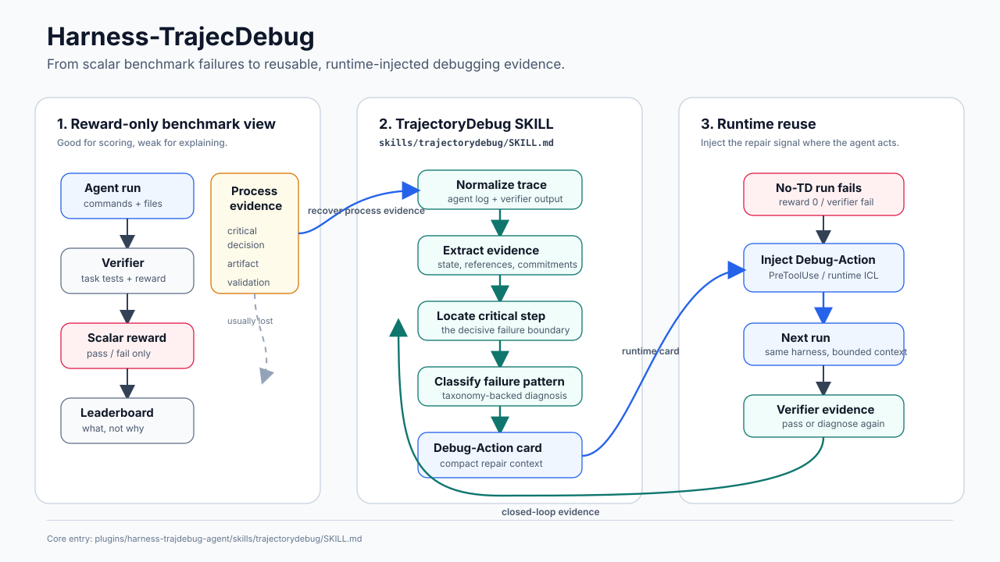

# Harness-TrajecDebug

Repository: <https://github.com/lwhere1314/Harness-TrajecDebug>

Harness-TrajecDebug turns terminal-agent pass/fail trajectories into
evidence-backed debugging context: critical failure steps, repair hints, and
Debug-Action cards that can be injected into later agent runs.

## Motivation

Terminal-agent benchmarks usually end with a scalar reward: the verifier passed
or failed. That is useful for scoring, but it throws away the most valuable
part of the run: the process evidence that explains why the agent failed.



The same failure often repeats across agents and models. A trace may show the
exact decision boundary where the agent chose the wrong artifact, trusted a
weak validation signal, entered a tool loop, or optimized the wrong metric. If
that evidence is preserved and normalized, it can become reusable debugging
context instead of one more failed run in a log directory.

Harness-TrajecDebug is built around a closed loop: recover the process evidence
that reward-only benchmarks discard, localize the critical step through the
TrajectoryDebug SKILL, synthesize a Debug-Action card, and inject that card
back into a later run at the next decision point.

The project deliberately stays harness-agnostic. Harbor, Terminal-Bench,
Meta-Harness-style runners, Claude Code, Codex, and Kimi Code still own task
execution and verifier rewards. Harness-TrajecDebug owns the layer that turns
their traces into portable failure evidence.

## Core SKILL / Algorithm

The most important entry point is the TrajectoryDebug SKILL:

```text
plugins/harness-trajdebug-agent/skills/trajectorydebug/SKILL.md
```

Direct link:
[`plugins/harness-trajdebug-agent/skills/trajectorydebug/SKILL.md`](plugins/harness-trajdebug-agent/skills/trajectorydebug/SKILL.md)

This is the agent-facing algorithm contract. It tells Claude Code, Codex, Kimi
Code, or another terminal agent how to diagnose an existing run from artifacts
instead of guessing from reward alone:

- join the agent trajectory with verifier stdout/stderr, reward files, and
  copied artifacts,
- classify whether a failure is valid, invalid, or infrastructure noise,
- locate the critical step using concrete trace evidence,
- route the failure through the taxonomy,
- choose the next action: rerun, repair card, verifier fix, environment fix,
  or no-op.

For runtime no-TD versus with-TD canaries, use the companion SKILL:

```text
plugins/harness-trajdebug-agent/skills/harness-runtime-icl/SKILL.md
```

Direct link:
[`plugins/harness-trajdebug-agent/skills/harness-runtime-icl/SKILL.md`](plugins/harness-trajdebug-agent/skills/harness-runtime-icl/SKILL.md)

Algorithm references:

- [`docs/framework.md`](docs/framework.md) explains the reference/state/decision
  evidence model.
- [`docs/failure-taxonomy.md`](docs/failure-taxonomy.md) defines failure
  patterns and repair levers.
- [`docs/blog/trajectorydebug-algorithm-flow.md`](docs/blog/trajectorydebug-algorithm-flow.md)
  gives the narrative algorithm flow.

## Benchmark Case Studies

The current evidence is best read as case-study and mechanism evidence, not as
a final held-out generalization benchmark. Start from the case-study index:

[`docs/case-studies/README.md`](docs/case-studies/README.md)

High-signal benchmark entries:

| Case study | What it shows | Entry |
| --- | --- | --- |
| `query-optimize` runtime Debug-Action | `no_icl` and outcome-only context stayed at reward `0.0`; Debug-Action runtime injection reached reward `1.0`. | [`docs/blog/query-optimize-runtime-debug-action.md`](docs/blog/query-optimize-runtime-debug-action.md) |
| `cancel-async-tasks` 4x reproduction | Without context: `0/4` pass. With Meta-Harness-style prior-failure context: `4/4` pass. | [`docs/case-studies/kimi-code-cancel-async-tasks-metaharness-2026-06-10/REPORT.md`](docs/case-studies/kimi-code-cancel-async-tasks-metaharness-2026-06-10/REPORT.md) |
| Kimi Code TB2.1 sweep | Reproduction snapshot with metrics, task-pair summaries, raw logs, and repair briefs. | [`docs/case-studies/kimi-code-tb21-metaharness-sweep-2026-06-10/REPORT.md`](docs/case-studies/kimi-code-tb21-metaharness-sweep-2026-06-10/REPORT.md) |
| Joint-failure lifting | Failed traces can still become useful ICL data when the critical decision boundary is clear. | [`docs/blog/sanitize-git-repo-joint-failure-lifting.md`](docs/blog/sanitize-git-repo-joint-failure-lifting.md), [`docs/blog/filter-js-from-html-clean-preservation.md`](docs/blog/filter-js-from-html-clean-preservation.md) |
| Raw query-optimize bundle | Prompts, teacher cards, task variants, Harbor runs, and checksums for the runtime Debug-Action case. | [`docs/blog/raw_logs/blog_raw_logs/README.md`](docs/blog/raw_logs/blog_raw_logs/README.md) |

## Quick Demo

Install the package and run the compact recorded demo:

```bash
python3 -m pip install -e .
HTD_DEMO_PAUSE=1 plugins/harness-trajdebug-agent/scripts/htd-agent demo query-optimize --recorded
```

The demo shows one complete loop:

```text
first agent run fails
-> Harness-TrajecDebug imports the trace
-> critical step is localized
-> a Debug-Action card is selected/generated
-> second run injects the card at PreToolUse(Bash)
-> verifier passes
```

For a live second attempt with a failure-derived card:

```bash
HTD_DEMO_PAUSE=1 HTD_DEMO_NO_FORCE_BUILD=1 HTD_DEMO_KEEP_ENVIRONMENT=1 \
  plugins/harness-trajdebug-agent/scripts/htd-agent demo query-optimize --live-fail-teacher
```

Recording notes and expected output are in [`demo/README.md`](demo/README.md).

## Agent Plugin

Install project-local skill shims for Claude Code, Codex, and Kimi Code:

```bash
python3 scripts/install_agent_plugin.py
```

Then use:

```text
/trajectorydebug diagnose this Harbor run
/harness-runtime-icl run a no-TD versus with-TD canary
```

Plugin and adapter details:

- [`docs/agent-plugin.md`](docs/agent-plugin.md)
- [`docs/integrations.md`](docs/integrations.md)
- [`plugins/harness-trajdebug-agent/.codex-plugin/plugin.json`](plugins/harness-trajdebug-agent/.codex-plugin/plugin.json)
- [`plugins/harness-trajdebug-agent/kimi.plugin.json`](plugins/harness-trajdebug-agent/kimi.plugin.json)

## CLI

Diagnose a bundled near-miss trace:

```bash
harness-trajdebug diagnose \
  --trace examples/traces/train-fasttext-kimi-k26-minimal.json \
  --run-id train-fasttext-kimi-k26-minimal \
  --output examples/diagnoses/train-fasttext-kimi-k26-diagnosis.json
```

Import and diagnose a Harbor run:

```bash
harness-trajdebug harbor-import \
  --run /path/to/harbor/run \
  --output-dir artifacts/normalized-harbor \
  --diagnose
```

Run a runtime ICL dry run:

```bash
plugins/harness-trajdebug-agent/scripts/htd-agent run-icl \
  --task TASK \
  --model kimi-k2.6 \
  --endpoint-profile auto \
  --context-variant debug_action \
  --inject-mode prelude \
  --dry-run
```

Check local readiness:

```bash
plugins/harness-trajdebug-agent/scripts/htd-agent doctor
```

## Repository Map

| Path | What lives there |
| --- | --- |
| [`src/harness_trajecdebug/`](src/harness_trajecdebug/) | Diagnosis core: parsing, adapters, failure patterns, critical-step selection. |
| [`plugins/harness-trajdebug-agent/`](plugins/harness-trajdebug-agent/) | Agent-facing plugin, SKILL files, and `htd-agent` wrapper. |
| [`docs/case-studies/`](docs/case-studies/) | Benchmark case studies, metrics, repair briefs, and raw evidence pointers. |
| [`docs/blog/`](docs/blog/) | Narrative mechanism writeups and raw-log explanations. |
| [`demo/`](demo/) | Recorded and live demo workflow. |
| [`experiments/harbor_icl_baseline/`](experiments/harbor_icl_baseline/) | ICL baseline protocol and runners. |
| [`examples/`](examples/) | Minimal traces and diagnosis outputs. |
| [`scripts/`](scripts/) | Experiment runners, preflight checks, and batch utilities. |

## Development

```bash
make test
make examples
python3 -m unittest discover -s tests
python3 -m py_compile src/harness_trajecdebug/*.py
```
