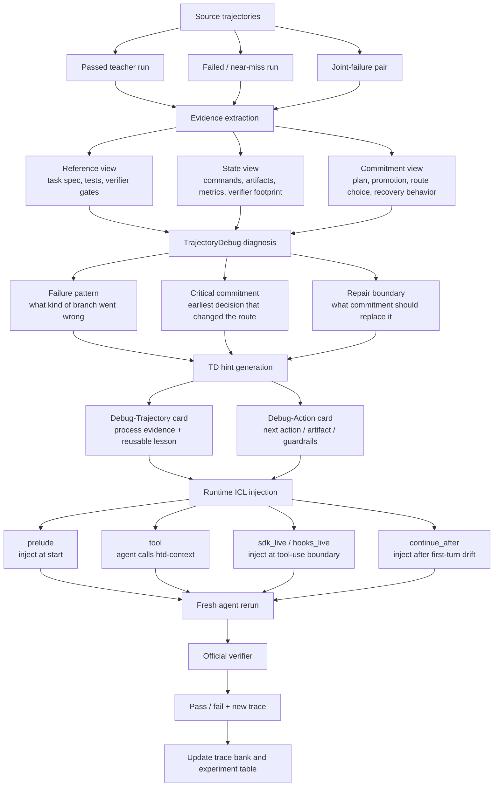
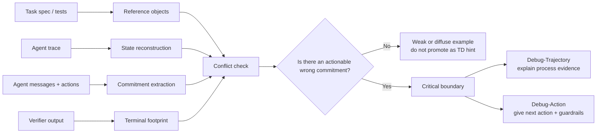
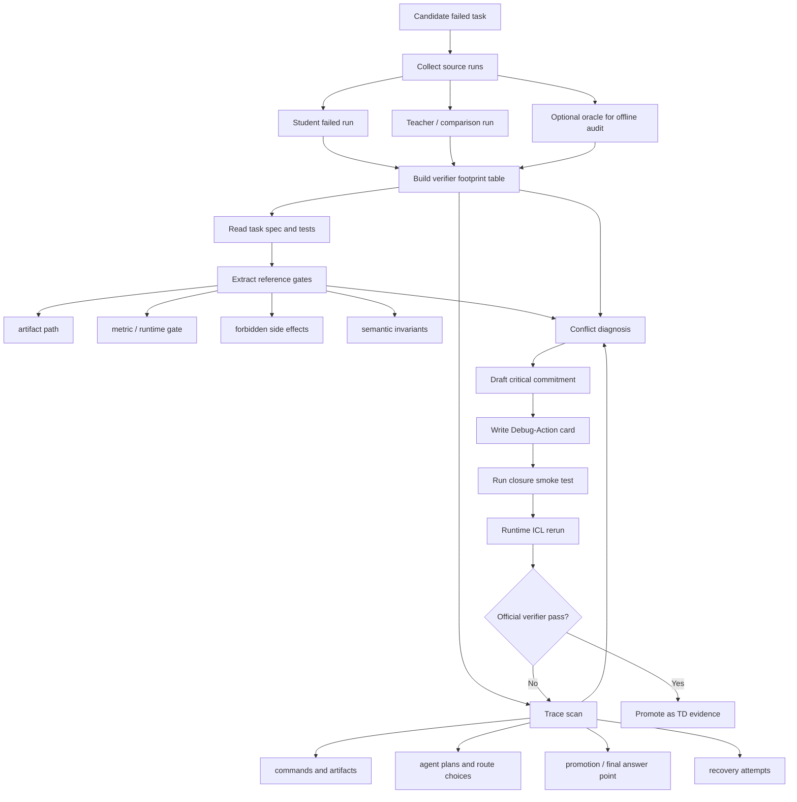

# 失败轨迹也能教会 Agent：Harness-TrajecDebug 的 Hint 生成与运行时注入

Benchmark 里的 `pass/fail` 很适合做排行榜，但不适合告诉我们一个
terminal agent 到底哪里弱。

一个任务失败之后，最有价值的问题通常不是：

> 它最后为什么没过 verifier？

而是：

> 它在哪一步开始走上了错误分支？如果在那一步给它一个正确的过程信号，
> 它能不能把原本失败的 case 修回来？

Harness-TrajecDebug 的目标就是把这个中间过程变成可复查、可注入、可实验的
对象。它不是简单地把成功 trace 塞进 prompt，而是把一条 source trajectory
拆成任务约束、执行状态、关键承诺和 verifier footprint，然后生成一个
Debug-Trajectory / Debug-Action hint，在 agent 还没有完全走偏的时候注入进去。

这里最核心的价值不是“给更多 context”，而是两件事必须同时成立：

1. **定位关键路径**：找出 agent 从理解任务转向承诺某条工程路线的 decisive boundary；
2. **在这个 boundary 注入 context**：让 corrective hint 出现在 agent 即将做出同类错误承诺、
   或者刚暴露同类状态的时候。

所以 `prelude` 只能算弱对照或上界实验：它回答“如果一开始就知道这条 TD card，能不能过”。
真正的 TD claim 要看 `sdk_live` / hooks / delayed injection 能不能在关键路径上把 agent
从失败分支拉回来。

这里的 source trajectory 可以是成功 run，也可以是失败 run。更有意思的是后者：
即使 Teacher Run 是错的，它也可能暴露出足够清楚的错误承诺，从而生成一个正确的
corrective hint。

## 一句话版本

Harness-TrajecDebug 做的是：

```text
source trajectory + verifier footprint
  -> 定位 wrong commitment
  -> 生成 corrective hint
  -> 在下一次 agent run 的关键路径上注入
  -> 看 verifier 是否从 0 变成 1
```

它补上的不是更多日志，而是 pass/fail reward 缺失的那一层：

```text
outcome evaluation
  -> trace-level process evaluation
  -> runtime process intervention
```

## 最适合放在 Blog 里的主流程图

如果只画一张图，我建议画成下面这样。重点是让读者一眼看到两条入口：

- 成功轨迹可以变成 reusable example；
- 失败轨迹也可以通过 TD diagnosis 变成 corrective hint。



这张图的好处是，它不会把读者带进具体代码细节，但完整表达了算法的关键闭环：

1. 先从轨迹里抽 evidence；
2. 再诊断 wrong commitment；
3. 再生成 hint；
4. 再把 hint 注入新的 agent run；
5. 最后用 official verifier 闭环。

## Hint 生成到底在做什么？

TD hint 不是一句泛泛的建议，例如“多检查 verifier”。

它应该包含四类信息：

| 组件 | 问题 | 例子 |
| --- | --- | --- |
| Reference | 任务真正要求什么？ | `/app/sol.sql`、runtime gate、clean HTML unchanged |
| State | source trajectory 观察到了什么？ | verifier failed test、artifact 缺失、metric 不过线 |
| Commitment | agent 当时相信或决定了什么？ | 把 SQL 优化成语义等价但不够快的查询 |
| Repair boundary | 下一次应该换成什么承诺？ | 先 materialize verified artifact，或者把 clean preservation 作为主约束 |

所以 hint 生成可以画成更细的一张内部图：



这里最关键的是 `Conflict check`。TD 不是看到失败就写建议，而是要问：

- 这个失败有没有 verifier footprint？
- trace 里有没有可引用的 wrong commitment？
- 这个 commitment 是否违反了某个 reference gate？
- 如果在这里换成正确承诺，后续 run 是否有可能改变结果？

满足这些条件，才值得生成 Debug-Action。

## 当前实现边界

这里需要诚实地区分两层。否则很容易把“能自动生成一张 card”和“能自动判断真正的
critical step”混在一起。

第一层是 `reward=1 teacher -> card` 的 baseline pack。这部分现在已经是脚本化的：
读取 `state.json`、任务说明、verifier 输出、event log 和 `/app/...` artifact，
自动生成 `outcome_only`、`raw_trace`、`prompt_filtered`、`debug_trajectory` 和
`debug_action`。

第二层是 `failed run -> corrective card`。这才是更核心的 TD 路线，但目前还不是完全
自动的 end-to-end learner。现在的做法是半自动诊断：先用脚本把候选失败、verifier
footprint、对比 run 和 artifact 组织出来，再由人按照 TD 框架归纳 critical
commitment，最后把诊断写成 Debug-Action card 并用 rerun 验证。`sanitize-git-repo`、
`filter-js-from-html`、`sam-cell-seg` 属于这条路线。

所以当前最准确的表述是：

> 我们已经打通了 failed-trace evidence -> corrective hint -> runtime injection ->
> verifier pass 的闭环；下一步是把其中的 critical-step extraction 和 card synthesis
> 从人工/半自动诊断推进到更自动的数据生产流程。

## 半自动诊断现在怎么做？

半自动诊断不是“凭感觉读日志写建议”。它大概有一个固定流程：



展开成操作步骤，大概是：

1. **找候选任务**：先用脚本扫本地 Harbor / Terminal-Bench 结果，找出 baseline 失败、
   对比 run 失败、或者同一任务多个 agent 都失败的 case。
2. **读 verifier footprint**：不是先读完整日志，而是先看失败落在哪个 verifier gate：
   runtime 太慢、artifact 不存在、clean input 被修改、schema 不匹配、metric 差一点、
   或者 forbidden side effect。
3. **抽 reference gate**：从 `instruction.md`、`tests/test.sh`、pytest 文件、golden
   output 或 artifact 约束里抽出真正的任务边界。
4. **扫 trace 里的 commitment**：找 agent 在哪一步开始相信某条路线是对的，例如
   “语义等价 SQL 就够了”、“sanitize repo 等于清理 git history”、“XSS blocking 是主目标，
   clean HTML 可以被重写”。
5. **对齐冲突**：把 commitment 和 reference / state 对上。如果只是一个局部命令报错，
   后面已经修复了，就不标成 critical step。只有它持续影响最终 verifier，才进入候选。
6. **写 repair boundary**：不要直接写“正确答案”，而是写下一次 run 应该遵守的决策边界，
   例如 preserve git history、clean-preservation first、materialize verified artifact
   before recomputation。
7. **跑闭环验证**：把 Debug-Action card 通过 `prelude`、`sdk_live` 或 hooks 注入新 run，
   看 official verifier 是否真的从 0 变 1。

这就是现在的“半自动”：候选发现、结果表、运行脚本、注入和 verifier 闭环是脚本化的；
critical-step 归因和 card synthesis 还需要人读 evidence、做因果判断、写成可执行 hint。

## 为什么 reward=1 的 card 更容易脚本化？

`reward=1` 的成功 run 有一个很强的锚点：最终 artifact 已经被 official verifier 接受。
所以脚本可以比较安全地做几件事：

- 读取任务说明，知道这个 artifact 属于哪个 contract；
- 读取 verifier summary，知道最终确实 pass；
- 抓取 `/app/...` 下的安全文本 artifact；
- 抽取和 verifier、promotion、artifact closure 有关的日志片段；
- 生成一张“这是一个已通过路径的 evidence bundle”。

这不要求脚本证明“哪一步是 critical step”。它只需要把成功 run 里可复用的 evidence
整理出来。对于 ICL baseline 来说，这已经有价值，因为它回答的是：

> 如果给小模型一个成功样本的 artifact、closure protocol 和少量 trace evidence，它会不会更容易过？

但你说得对：成功 run 里的 critical step 也不一定显而易见。一个成功 trace 可能有很多
看起来重要的动作：

- 读了测试；
- 改了实现；
- 运行了本地验证；
- 修了一个 bug；
- 最后复制 artifact；
- 停在正确时机。

这些动作里哪一个是“真正改变结果”的 critical step，并不总能从 reward=1 自动推出。
因为成功 trace 没有负例 footprint。它告诉我们“这条路径可行”，但不一定告诉我们
“如果删掉哪一步就会失败”。

所以当前脚本化的 `reward=1 -> debug_action` 更准确地说是：

```text
passed trajectory -> reusable positive evidence card
```

还不是：

```text
passed trajectory -> automatically proven critical-step label
```

这也是为什么要把 baseline pack 和 TD critical-step diagnosis 分开讲。前者是可自动化的
数据整理，后者是更难的因果归因。

## 为什么 failed-run 自动化更难？

失败轨迹的难点不是“没有答案”，而是有太多可能的解释。

同样 reward 0，可能代表：

- agent 根本没理解任务；
- agent 理解了任务，但把主约束排错了优先级；
- local validation 和 official verifier 不对齐；
- artifact 写对了但放错路径；
- 工具/API 被误用；
- dependency 或 sandbox 环境失败；
- 已经很接近，只是 margin 太薄；
- 任务本身的 verifier 有工程噪声；
- 多个错误叠在一起，没有单一 root cause。

要自动生成 corrective hint，系统必须解决几个比“日志摘要”难得多的问题。

### 1. Reference object 不总是显式的

有些任务的关键约束写在自然语言里，有些藏在 `tests/test.sh`，有些藏在 pytest 的断言，
有些藏在 golden file 或私有 verifier 语义里。脚本可以抽文件路径和 reward，但很难自动知道：

- clean HTML unchanged 才是 `filter-js-from-html` 的 binding constraint；
- preserve reference commit 才是 `sanitize-git-repo` 的核心边界；
- runtime gate 比语义等价更关键；
- size gate 不是后处理，而是搜索主约束。

这一步需要把 task spec、test code 和 verifier output 统一成 reference objects。

### 2. Commitment 经常不是一句话写出来的

agent 很少明确说“我决定犯这个错”。很多 commitment 是从行动序列里体现出来的：

- 反复调大模型，而不是搜索 compact frontier；
- 通过本地 validation 后直接 promote；
- 看到 artifact 过大后只走 quantization；
- 运行 history-rewriting 命令；
- 用 aggressive sanitizer 重写 clean input。

自动化系统必须从 message、command、file diff 和后续行动中推断“它此刻相信了什么”。
这比抽关键词难，因为同一个命令在不同上下文里可能是正常探索，也可能是错误承诺。

### 3. Critical step 不是最后一个错误

最终 verifier error 往往只是症状。真正 critical 的可能早很多。

例如一个 run 最后失败在 runtime gate，但关键问题不是最后一次运行慢，而是很早就把任务
理解成“写一个语义等价 SQL”而不是“写一个比 golden 足够快的 SQL”。一个 run 最后失败在
clean HTML unchanged，但关键问题不是最后输出格式，而是开始就把任务当成 aggressive
sanitization。

自动化要找的是 earliest decisive commitment，而不是最后的 error line。

### 4. 需要反事实判断

判断 critical step，本质上要问一个反事实问题：

> 如果在这一步换成正确承诺，后面的结果会不会改变？

这个问题很难完全自动证明。因为 agent 后续可能仍然失败，另一个路线可能也有坑，
同一个 repair boundary 可能有多种实现。现在的实践是用 runtime rerun 近似检验：
把 Debug-Action 注入下一次 run，如果 official verifier 从 0 变 1，说明这个诊断至少有
实际干预价值。

### 5. Card synthesis 不能只是“把答案贴上去”

如果 card 写得太弱，模型不会改变路线；如果写得太强，就变成同题答案泄漏，不能支持
更一般的数据选择 claim。尤其是 oracle-grounded audit，要非常小心：

- oracle 可以帮助离线识别 critical boundary；
- 但 blog 和实验要区分“oracle 用于诊断”与“oracle script 直接进入 prompt”；
- 更有说服力的是 oracle-free joint-failure card，也就是只从失败 trace 和 verifier
  footprint 里合成 repair boundary。

Card synthesis 的难点是控制粒度：既要 actionable，又不能把所有东西退化成复制答案。

## 自动化数据生产的真正瓶颈

所以瓶颈不是“让 LLM 写一段总结”。真正难的是把每个 TD card 变成一个有证据、有因果
含义、能被 verifier 验证的数据点。

可以把瓶颈拆成五个模块：

| 模块 | 自动化难点 | 失败风险 |
| --- | --- | --- |
| Reference extraction | 从自然语言、test code、verifier 中抽真实约束 | 把次要约束当主约束 |
| State reconstruction | 统一命令、artifact、metric、diff、stderr | 漏掉关键状态变化 |
| Commitment inference | 从行动序列推断 agent 的路线选择 | 把正常探索误判成错误承诺 |
| Counterfactual attribution | 判断哪个 step 改了结果分支 | 只标到最后症状，不是根因 |
| Card synthesis | 写出可执行但不过度泄漏的 hint | 过弱无效，过强变答案复制 |

这也是为什么这个问题是开放式的：自动化数据生产不是把 trace 过滤一下，而是要做
process-level causal labeling。

一个比较现实的路线可能是分阶段推进：

1. **规则抽取 reference/state**：先把 artifact path、failed tests、metric、file diff、
   verifier output 自动结构化。
2. **LLM 生成候选 critical commitments**：让模型提出 2 到 3 个可引用的候选，而不是直接
   给最终结论。
3. **证据约束过滤**：要求每个候选绑定具体 trace quote、reference object 和 terminal
   footprint。
4. **生成多张候选 Debug-Action card**：每张 card 对应一个 repair boundary。
5. **用 verifier 做选择**：真正能把 rerun 从 fail 变 pass 的 card，才进入高质量数据池。

换句话说，最终的自动化不应该只相信 LLM judge。它应该是：

```text
LLM proposes causal hypotheses
  -> structured evidence checker filters them
  -> runtime rerun tests them
  -> verifier selects useful cards
```

这条路线慢一些，但更符合 TD 的目标：让每条训练数据都带着可审计的过程证据，而不是只带
一个漂亮的自然语言总结。

## 成功 Run 和失败 Run 的区别

很多 ICL baseline 默认只用成功样本。这个当然有价值，但它回答的是：

> 一个小模型能不能模仿成功路径？

TD 还想回答另一个问题：

> 一个失败路径能不能告诉我们“不要再这样走”，并产生更强的修正信号？

两种来源可以这样理解：

| Source trajectory | 生成的 hint | 作用 |
| --- | --- | --- |
| Passed teacher run | reusable artifact / successful closure protocol | 教 agent 复用一条已经过 verifier 的路径 |
| Near miss run | thin-margin warning / missing closure signal | 教 agent 补上最后一层 verifier alignment |
| Failed run | wrong commitment + repair boundary | 教 agent 避免原来的失败分支 |
| Joint-failure pair | complementary failure contrast | 用两个失败轨迹合成一个正确约束 |

这也是目前最有意思的结果：`sanitize-git-repo`、`filter-js-from-html`、
`sam-cell-seg` 这类 case 不是简单从成功 teacher 抄答案，而是从失败 footprint
里抽出正确的 process boundary。

## 运行时如何注入？

Hint 生成之后，还要决定什么时候给 agent。

现在 repo 里支持五种注入方式：

| Mode | 方式 | 适合回答的问题 |
| --- | --- | --- |
| `prelude` | 开局直接把 card 放进 prompt | 最大上界：如果一开始就知道，会不会过 |
| `tool` | 暴露 `htd-context`，让 agent 主动调用 | agent 是否会主动请求 prior-trace lesson |
| `continue_after` | 先裸跑一段，发现漂移再继续注入 | hint 能不能把已经开始走偏的 run 拉回来 |
| `sdk_live` | 用 Claude Agent SDK 拦截 tool event | 能不能在关键工具调用前精准注入 |
| `hooks_live` | 用 Claude Code hooks 注入 additionalContext | 更接近 CLI 原生运行方式 |

Blog 里不用展开所有工程细节，核心写清楚一句话就够了：

> 我们希望 hint 出现在 agent 从“理解任务”转向“承诺一个工程路线”的时刻。

因此实验报告必须区分两种 with-TD：

| Condition | 它验证什么 | 能不能代表核心算法 |
| --- | --- | --- |
| `td_full + prelude` | 开局给 TD card 的 broad sanity / upper-bound ablation | 不能单独代表；它没有测试关键路径定位和中途注入 |
| `debug_action + sdk_live/hooks_live` | 在工具调用、依赖安装、AskUserQuestion 或指定 state boundary 前插入纠偏 hint | 可以代表核心闭环 |

如果 with-TD 在 `reference_only_fallback` card 上失败，这不能说明 TD 算法失败，只能说明这个
task 还没有完成 critical-step 诊断。如果 `debug_action` 存在但 `prelude` 失败，下一步要看的是
agent 是否忽略了 card，还是 card 应该换到更合适的 runtime boundary 注入。

例如 `query-optimize` 里，`sdk_live` 在第一次 Bash schema inspection 前注入
Debug-Action。这个位置很重要，因为 agent 正要开始选择 SQL 优化路线；如果此时只给
outcome-only，它仍然会重走慢查询路线；如果给 Debug-Action，它会 materialize
已经通过 verifier 的 `/app/sol.sql`，最后 reward 从 0 变成 1。

## 一个可以放进 Blog 的算法伪代码

```text
Algorithm: TrajectoryDebug Hint Generation + Runtime ICL

Input:
  source trajectories T
  task spec and tests R
  verifier outputs V
  target agent / harness H

For each candidate task:
  1. Extract reference objects from R
       artifact path, metric gate, verifier semantics, forbidden side effects

  2. Reconstruct state from T
       commands, artifacts, metrics, errors, final verifier footprint

  3. Extract commitments from T
       explicit plans, promoted artifacts, route choices, recovery decisions

  4. Compare commitment against reference and state
       if no actionable conflict:
         mark as weak example
       else:
         identify earliest critical commitment

  5. Generate TD hint
       Debug-Trajectory: evidence + failure pattern + repair lesson
       Debug-Action: next action / artifact / guardrails

  6. Inject hint into a fresh target-agent run
       prelude, tool, continue_after, sdk_live, or hooks_live

  7. Run official verifier
       record reward, logs, injection event, and failure-pattern shift

Output:
  verifier result
  TD card
  injection trace
  reusable data-quality label
```

## 现在可以怎么讲这个项目的贡献？

我建议 blog 里把贡献写成三句话：

1. **从 outcome 到 process**：不只看 agent 最后 pass/fail，而是定位 trace 中改变结果的
   critical commitment。
2. **失败轨迹也能变成数据**：不是只有成功 run 才能当 teacher；失败 run 的 verifier
   footprint 可以合成 corrective hint。
3. **从离线诊断到在线干预**：TD card 不只是报告，它可以通过 `sdk_live` / hooks 在下一次
   agent run 的关键路径上注入，并用 official verifier 检验是否真的修复。

## 当前实验证据怎么放？

可以用一个简短表格，不要铺太多 raw log：

| Result | Meaning |
| --- | --- |
| `query-optimize`: `outcome_only + sdk_live` failed, `debug_action + sdk_live` passed | 过程型 hint 比 outcome-only 更有用 |
| `sanitize-git-repo`: Codex + GPT failed, Kimi failed, TD rerun passed | failed traces can synthesize a corrective boundary |
| `filter-js-from-html`: both agents failed clean-preservation, TD rerun passed | shared failure footprint can identify the binding verifier gate |
| TB2.1 Kimi-k2.6: `38/89 -> 46/89` | 当前闭环 lift 是 8 个任务 |

最后一句可以落到下一步：

> 接下来要证明的不是“某个同题 hint 能救回来”，而是在 Harbor-style held-out
> tasks 上，TD-selected examples 是否比 outcome-only、raw trace、prompt-filtered
> examples 更能提升小模型 pass rate。

## 图的设计建议

如果要做成真正 blog 配图，我建议保留两张：

1. **主流程图**：source trajectories -> TD diagnosis -> hint generation ->
   runtime injection -> verifier。
2. **hint 内部图**：reference/state/commitment/verifier footprint -> conflict
   check -> critical boundary -> Debug-Trajectory / Debug-Action。

不要一开始就画所有 agent SDK、hook、Harbor config、Docker 文件路径。那些是工程实现，
适合放 repo 文档；blog 读者先理解算法闭环就够了。
