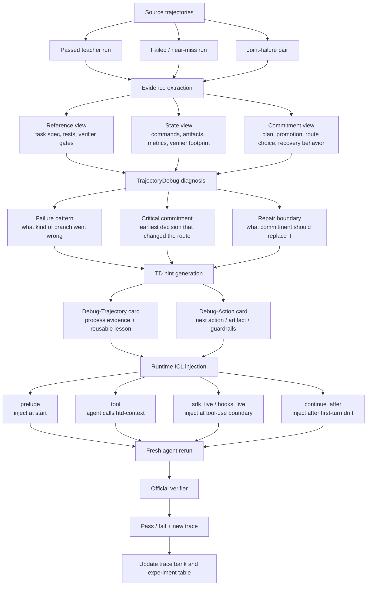
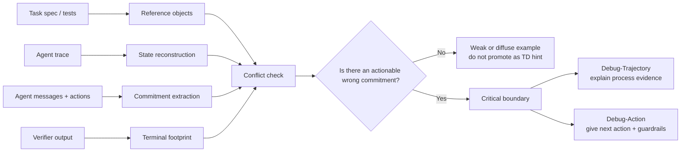

# 失败轨迹也能教会 Agent：Harness-TrajecDebug 的 Hint 生成与运行时注入

Benchmark 里的 `pass/fail` 很适合做排行榜，但不适合告诉我们一个
terminal agent 到底哪里弱。

一个任务失败之后，最有价值的问题通常不是：

> 它最后为什么没过 verifier？

而是：

> 它在哪一步开始走上了错误分支？如果在那一步给它一个正确的过程信号，
> 它能不能把原本失败的 case 修回来？

Harness-TrajecDebug 的目标就是把这个中间过程变成可复查、可注入、可实验的
对象。它不是简单地把成功 trace 塞进 prompt，而是把一条 source trajectory
拆成任务约束、执行状态、关键承诺和 verifier footprint，然后生成一个
Debug-Trajectory / Debug-Action hint，在 agent 还没有完全走偏的时候注入进去。

这里的 source trajectory 可以是成功 run，也可以是失败 run。更有意思的是后者：
即使 Teacher Run 是错的，它也可能暴露出足够清楚的错误承诺，从而生成一个正确的
corrective hint。

## 一句话版本

Harness-TrajecDebug 做的是：

```text
source trajectory + verifier footprint
  -> 定位 wrong commitment
  -> 生成 corrective hint
  -> 在下一次 agent run 的关键路径上注入
  -> 看 verifier 是否从 0 变成 1
```

它补上的不是更多日志，而是 pass/fail reward 缺失的那一层：

```text
outcome evaluation
  -> trace-level process evaluation
  -> runtime process intervention
```

## 最适合放在 Blog 里的主流程图

如果只画一张图，我建议画成下面这样。重点是让读者一眼看到两条入口：

- 成功轨迹可以变成 reusable example；
- 失败轨迹也可以通过 TD diagnosis 变成 corrective hint。



这张图的好处是，它不会把读者带进具体代码细节，但完整表达了算法的关键闭环：

1. 先从轨迹里抽 evidence；
2. 再诊断 wrong commitment；
3. 再生成 hint；
4. 再把 hint 注入新的 agent run；
5. 最后用 official verifier 闭环。

## Hint 生成到底在做什么？

TD hint 不是一句泛泛的建议，例如“多检查 verifier”。

它应该包含四类信息：

| 组件 | 问题 | 例子 |
| --- | --- | --- |
| Reference | 任务真正要求什么？ | `/app/sol.sql`、runtime gate、clean HTML unchanged |
| State | source trajectory 观察到了什么？ | verifier failed test、artifact 缺失、metric 不过线 |
| Commitment | agent 当时相信或决定了什么？ | 把 SQL 优化成语义等价但不够快的查询 |
| Repair boundary | 下一次应该换成什么承诺？ | 先 materialize verified artifact，或者把 clean preservation 作为主约束 |

所以 hint 生成可以画成更细的一张内部图：



这里最关键的是 `Conflict check`。TD 不是看到失败就写建议，而是要问：

- 这个失败有没有 verifier footprint？
- trace 里有没有可引用的 wrong commitment？
- 这个 commitment 是否违反了某个 reference gate？
- 如果在这里换成正确承诺，后续 run 是否有可能改变结果？

满足这些条件，才值得生成 Debug-Action。

## 当前实现边界

这里需要诚实地区分两层：

1. `reward=1 teacher -> card` 的 baseline pack 现在已经是脚本化的：读取
   `state.json`、任务说明、verifier 输出、event log 和 `/app/...` artifact，
   自动生成 `outcome_only`、`raw_trace`、`prompt_filtered`、`debug_trajectory`
   和 `debug_action`。
2. `failed run -> corrective card` 是更核心的 TD 路线，但目前还不是完全自动的
   end-to-end learner。现在的做法是先用 TD 框架读失败轨迹和 verifier footprint，
   归纳 critical commitment，再把这个诊断写成 Debug-Action card。`sanitize-git-repo`
   和 `filter-js-from-html` 属于这条路线。

所以当前最准确的表述是：

> 我们已经打通了 failed-trace evidence -> corrective hint -> runtime injection ->
> verifier pass 的闭环；下一步是把其中的 critical-step extraction 和 card synthesis
> 从人工/半自动诊断推进到更自动的数据生产流程。

## 成功 Run 和失败 Run 的区别

很多 ICL baseline 默认只用成功样本。这个当然有价值，但它回答的是：

> 一个小模型能不能模仿成功路径？

TD 还想回答另一个问题：

> 一个失败路径能不能告诉我们“不要再这样走”，并产生更强的修正信号？

两种来源可以这样理解：

| Source trajectory | 生成的 hint | 作用 |
| --- | --- | --- |
| Passed teacher run | reusable artifact / successful closure protocol | 教 agent 复用一条已经过 verifier 的路径 |
| Near miss run | thin-margin warning / missing closure signal | 教 agent 补上最后一层 verifier alignment |
| Failed run | wrong commitment + repair boundary | 教 agent 避免原来的失败分支 |
| Joint-failure pair | complementary failure contrast | 用两个失败轨迹合成一个正确约束 |

这也是目前最有意思的结果：`sanitize-git-repo`、`filter-js-from-html`、
`sam-cell-seg` 这类 case 不是简单从成功 teacher 抄答案，而是从失败 footprint
里抽出正确的 process boundary。

## 运行时如何注入？

Hint 生成之后，还要决定什么时候给 agent。

现在 repo 里支持五种注入方式：

| Mode | 方式 | 适合回答的问题 |
| --- | --- | --- |
| `prelude` | 开局直接把 card 放进 prompt | 最大上界：如果一开始就知道，会不会过 |
| `tool` | 暴露 `htd-context`，让 agent 主动调用 | agent 是否会主动请求 prior-trace lesson |
| `continue_after` | 先裸跑一段，发现漂移再继续注入 | hint 能不能把已经开始走偏的 run 拉回来 |
| `sdk_live` | 用 Claude Agent SDK 拦截 tool event | 能不能在关键工具调用前精准注入 |
| `hooks_live` | 用 Claude Code hooks 注入 additionalContext | 更接近 CLI 原生运行方式 |

Blog 里不用展开所有工程细节，核心写清楚一句话就够了：

> 我们希望 hint 出现在 agent 从“理解任务”转向“承诺一个工程路线”的时刻。

例如 `query-optimize` 里，`sdk_live` 在第一次 Bash schema inspection 前注入
Debug-Action。这个位置很重要，因为 agent 正要开始选择 SQL 优化路线；如果此时只给
outcome-only，它仍然会重走慢查询路线；如果给 Debug-Action，它会 materialize
已经通过 verifier 的 `/app/sol.sql`，最后 reward 从 0 变成 1。

## 一个可以放进 Blog 的算法伪代码

```text
Algorithm: TrajectoryDebug Hint Generation + Runtime ICL

Input:
  source trajectories T
  task spec and tests R
  verifier outputs V
  target agent / harness H

For each candidate task:
  1. Extract reference objects from R
       artifact path, metric gate, verifier semantics, forbidden side effects

  2. Reconstruct state from T
       commands, artifacts, metrics, errors, final verifier footprint

  3. Extract commitments from T
       explicit plans, promoted artifacts, route choices, recovery decisions

  4. Compare commitment against reference and state
       if no actionable conflict:
         mark as weak example
       else:
         identify earliest critical commitment

  5. Generate TD hint
       Debug-Trajectory: evidence + failure pattern + repair lesson
       Debug-Action: next action / artifact / guardrails

  6. Inject hint into a fresh target-agent run
       prelude, tool, continue_after, sdk_live, or hooks_live

  7. Run official verifier
       record reward, logs, injection event, and failure-pattern shift

Output:
  verifier result
  TD card
  injection trace
  reusable data-quality label
```

## 现在可以怎么讲这个项目的贡献？

我建议 blog 里把贡献写成三句话：

1. **从 outcome 到 process**：不只看 agent 最后 pass/fail，而是定位 trace 中改变结果的
   critical commitment。
2. **失败轨迹也能变成数据**：不是只有成功 run 才能当 teacher；失败 run 的 verifier
   footprint 可以合成 corrective hint。
3. **从离线诊断到在线干预**：TD card 不只是报告，它可以通过 `sdk_live` / hooks 在下一次
   agent run 的关键路径上注入，并用 official verifier 检验是否真的修复。

## 当前实验证据怎么放？

可以用一个简短表格，不要铺太多 raw log：

| Result | Meaning |
| --- | --- |
| `query-optimize`: `outcome_only + sdk_live` failed, `debug_action + sdk_live` passed | 过程型 hint 比 outcome-only 更有用 |
| `sanitize-git-repo`: Codex + GPT failed, Kimi failed, TD rerun passed | failed traces can synthesize a corrective boundary |
| `filter-js-from-html`: both agents failed clean-preservation, TD rerun passed | shared failure footprint can identify the binding verifier gate |
| TB2.1 Kimi-k2.6: `38/89 -> 46/89` | 当前闭环 lift 是 8 个任务 |

最后一句可以落到下一步：

> 接下来要证明的不是“某个同题 hint 能救回来”，而是在 Harbor-style held-out
> tasks 上，TD-selected examples 是否比 outcome-only、raw trace、prompt-filtered
> examples 更能提升小模型 pass rate。

## 图的设计建议

如果要做成真正 blog 配图，我建议保留两张：

1. **主流程图**：source trajectories -> TD diagnosis -> hint generation ->
   runtime injection -> verifier。
2. **hint 内部图**：reference/state/commitment/verifier footprint -> conflict
   check -> critical boundary -> Debug-Trajectory / Debug-Action。

不要一开始就画所有 agent SDK、hook、Harbor config、Docker 文件路径。那些是工程实现，
适合放 repo 文档；blog 读者先理解算法闭环就够了。
