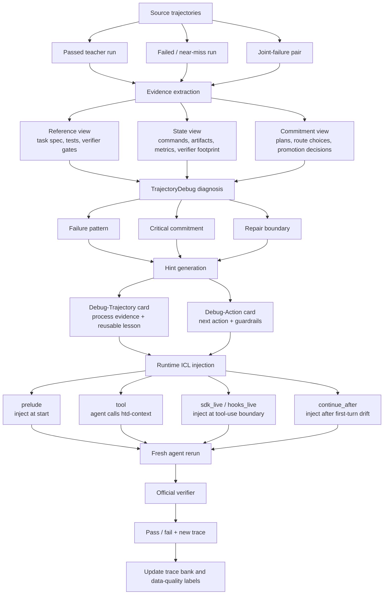
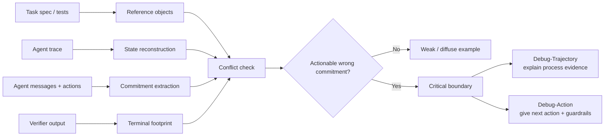
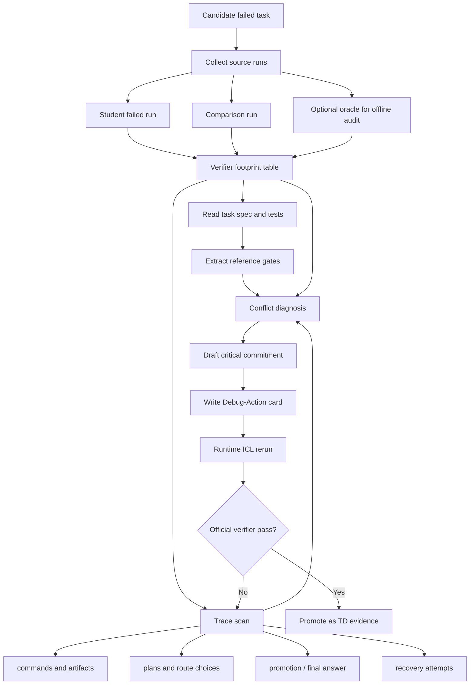

# 失败轨迹也能教会 Agent：TrajectoryDebug 的核心算法

> 从 pass/fail reward 到 critical commitment，再到运行时 corrective hint。

Terminal-agent benchmark 里的 `pass/fail` 很适合做排行榜，但它对改进 agent
并不够友好。

一个任务失败之后，我们当然可以问：

> 它为什么没过 verifier？

但对 harness、agent workflow 和小模型蒸馏来说，更重要的问题其实是：

> 它在哪一步开始走上了错误分支？如果在那一步给它一个正确的过程信号，它能不能把原本失败的 case 修回来？

这就是我最近在做 Harness-TrajecDebug 时最想解决的问题。

它的核心思路不是简单地把成功 trace 塞进 prompt，而是把一条 source trajectory
拆成任务约束、执行状态、关键承诺和 verifier footprint，定位 agent 最早走偏的
critical commitment，再生成一个 Debug-Trajectory / Debug-Action hint，在下一次
agent run 的关键路径上注入进去。

这里最重要的一点是：

> source trajectory 不一定要是成功 run。失败 run 也可以成为数据。

如果一个失败轨迹暴露出了足够清楚的 wrong commitment，我们就可以从它生成一个正确的
corrective hint。这个 hint 不是“答案”，而是下一次运行时应该避免的错误分支和应该遵守的
repair boundary。

## 一句话版本

TrajectoryDebug 做的是：

```text
source trajectory + verifier footprint
  -> locate wrong commitment
  -> synthesize corrective hint
  -> inject hint into a fresh agent run
  -> validate with official verifier
```

它补上的不是更多日志，而是 reward 缺失的那一层过程信号：

```text
outcome evaluation
  -> trace-level process evaluation
  -> runtime process intervention
```

## 核心流程图

如果只画一张图，我会把 TrajectoryDebug 画成下面这样：



这张图里有两个入口。

第一种入口是成功轨迹。成功 run 可以提供 verified artifact、artifact closure protocol
和少量可复用 trace evidence。它适合作为 ICL baseline，也适合回答一个比较直接的问题：

> 如果给小模型一个已经通过 verifier 的成功样本，它会不会更容易完成同类任务？

第二种入口是失败轨迹。失败 run 没有直接给出成功答案，但它可能告诉我们模型在哪里走偏。
这条路径更像真正的 TrajectoryDebug：

> 如果两个 agent 都失败了，或者一个强模型也失败了，我们能不能从失败 footprint 里抽出正确的过程边界，再让另一个 agent 修回来？

## 三个视角：Reference、State、Commitment

TrajectoryDebug 的诊断不是“读完整条日志后写总结”。它先把 trace 拆成三个视角。

| View | 它回答的问题 | 例子 |
| --- | --- | --- |
| Reference view | 任务真正要求什么？ | artifact path、metric gate、runtime gate、clean input unchanged、forbidden side effects |
| State view | agent 实际让世界发生了什么变化？ | command output、file diff、artifact size、verifier failed test、metric margin |
| Commitment view | agent 在某一步相信或决定了什么？ | 选择某条搜索路线、promote 某个 artifact、信任某个 local validation、放弃某个约束 |

这三者对齐之后，才会进入 critical-step 判断。



这里最关键的是 `Conflict check`。TrajectoryDebug 不会因为某条命令报错就立刻说这是
critical step，而是要问四个问题：

1. 这个错误有没有 final verifier footprint？
2. trace 里有没有可引用的 wrong commitment？
3. 这个 commitment 是否违反了某个 reference gate 或 state observation？
4. 如果在这里换成正确承诺，后续 run 是否有机会改变结果？

只有满足这些条件，它才值得被写成 Debug-Action。

## 半自动诊断现在怎么做？

当前的 failed-run 诊断还不是完全自动化的。更准确地说，它是半自动：

- 候选任务发现、结果表、run 脚本、runtime injection、verifier 闭环是脚本化的；
- critical-step 归因和 card synthesis 还需要人读 evidence、做因果判断、写成可执行 hint。

现在的流程大概是：



展开说就是：

1. 先用脚本扫本地 Harbor / Terminal-Bench 结果，找 baseline 失败、对比 run 失败、或者多个 agent 都失败的 case。
2. 先读 verifier footprint，而不是一上来读完整日志。看失败落在哪个 gate：runtime 太慢、artifact 缺失、clean input 被修改、schema 不匹配、metric 差一点，还是 forbidden side effect。
3. 从 `instruction.md`、`tests/test.sh`、pytest 文件、golden output 或 artifact 约束里抽真正的 reference gate。
4. 扫 trace 里的 commitment：agent 在什么时候开始相信某条路线是对的？
5. 把 commitment 和 reference / state 对齐，排除已经被修复的局部错误。
6. 写出 repair boundary，而不是直接贴答案。
7. 用 `prelude`、`sdk_live` 或 hooks 注入新 run，最后让 official verifier 判断是否真的修复。

这一步之所以重要，是因为很多失败不是“不会写代码”，而是 agent 在中间做了一个错误承诺。

比如：

- `sanitize-git-repo` 里，错误承诺可能是“sanitize repo 等于重写 git history”，正确边界是 bounded working-tree edit，保留 reference commit。
- `filter-js-from-html` 里，错误承诺可能是“XSS blocking 是唯一主目标”，正确边界是 clean HTML preservation 也是 binding verifier gate。
- `query-optimize` 里，错误承诺可能是“语义等价 SQL 就够了”，正确边界是 runtime gate 必须过，必要时直接 materialize verifier-proven artifact。

## 为什么 reward=1 更容易脚本化？

`reward=1` 的成功 run 有一个很强的锚点：最终 artifact 已经被 official verifier 接受。

所以脚本可以比较安全地做几件事：

- 读取任务说明，知道 artifact 属于哪个 contract；
- 读取 verifier summary，确认最终确实 pass；
- 抓取 `/app/...` 下的安全文本 artifact；
- 抽取和 verifier、promotion、artifact closure 有关的日志片段；
- 生成一张“这是一个已通过路径的 evidence bundle”。

这不要求脚本证明哪一步是 critical step。它只需要把成功 run 里可复用的 evidence
整理出来。

但这里有一个容易误解的地方：

> 成功 run 可以脚本化整理，不代表成功 run 的 critical step 就自动显而易见。

一个成功 trace 里可能有很多看起来重要的动作：读测试、改实现、跑本地验证、修 bug、
复制 artifact、最后停在正确时机。哪一步是真正改变结果的 critical step，并不能从
`reward=1` 自动推出。

所以当前脚本化的 `reward=1 -> debug_action` 更准确地说是：

```text
passed trajectory -> reusable positive evidence card
```

而不是：

```text
passed trajectory -> automatically proven critical-step label
```

这也是为什么我把 baseline pack 和 TD critical-step diagnosis 分开。前者是可自动化的
数据整理，后者是更难的因果归因。

## 为什么 failed-run 自动化更难？

失败轨迹的难点不是“没有答案”，而是有太多可能解释。

同样 reward 0，可能代表：

- agent 根本没理解任务；
- agent 理解了任务，但把主约束排错了优先级；
- local validation 和 official verifier 不对齐；
- artifact 写对了但放错路径；
- 工具/API 被误用；
- dependency 或 sandbox 环境失败；
- 已经很接近，只是 margin 太薄；
- 任务本身 verifier 有工程噪声；
- 多个错误叠在一起，没有单一 root cause。

要自动生成 corrective hint，系统要解决的不是日志摘要，而是 process-level causal labeling。
瓶颈主要有五个：

| 模块 | 自动化难点 | 失败风险 |
| --- | --- | --- |
| Reference extraction | 从自然语言、test code、verifier 中抽真实约束 | 把次要约束当主约束 |
| State reconstruction | 统一命令、artifact、metric、diff、stderr | 漏掉关键状态变化 |
| Commitment inference | 从行动序列推断 agent 的路线选择 | 把正常探索误判成错误承诺 |
| Counterfactual attribution | 判断哪个 step 改了结果分支 | 只标到最后症状，不是根因 |
| Card synthesis | 写出可执行但不过度泄漏的 hint | 过弱无效，过强变答案复制 |

这里最难的是反事实判断。

所谓 critical step，本质上是在问：

> 如果在这一步换成正确承诺，后面的结果会不会改变？

这个问题很难完全靠静态日志自动证明。因为后续 agent 可能还会失败，另一个路线可能也有坑，
同一个 repair boundary 也可能有多种实现。现在更现实的做法是用 runtime rerun 做近似检验：

```text
LLM proposes causal hypotheses
  -> structured evidence checker filters them
  -> runtime rerun tests them
  -> verifier selects useful cards
```

这条路线慢一些，但更符合 TD 的目标：让每条数据都带着可审计的过程证据，而不是只带一个
漂亮的自然语言总结。

## 运行时如何注入？

Hint 生成之后，还要决定什么时候给 agent。

现在 repo 里支持五种注入方式：

| Mode | 方式 | 适合回答的问题 |
| --- | --- | --- |
| `prelude` | 开局直接把 card 放进 prompt | 最大上界：如果一开始就知道，会不会过 |
| `tool` | 暴露 `htd-context`，让 agent 主动调用 | agent 是否会主动请求 prior-trace lesson |
| `continue_after` | 先裸跑一段，发现漂移再继续注入 | hint 能不能把已经开始走偏的 run 拉回来 |
| `sdk_live` | 用 Claude Agent SDK 拦截 tool event | 能不能在关键工具调用前精准注入 |
| `hooks_live` | 用 Claude Code hooks 注入 additionalContext | 更接近 CLI 原生运行方式 |

核心目标不是“把 prompt 变长”，而是：

> 让 hint 出现在 agent 从理解任务转向承诺工程路线的时刻。

例如 `query-optimize` 里，`sdk_live` 在第一次 Bash schema inspection 前注入
Debug-Action。这个位置很重要，因为 agent 正要开始选择 SQL 优化路线。只给
outcome-only，它仍然会重走慢查询路线；给 Debug-Action，它会 materialize 已经通过
verifier 的 `/app/sol.sql`，最后 reward 从 0 变成 1。

## 当前证据

目前最重要的不是说系统已经完全自动化，而是这个闭环已经跑通了。

| Result | Meaning |
| --- | --- |
| `query-optimize`: `outcome_only + sdk_live` failed, `debug_action + sdk_live` passed | process-aware hint 比 outcome-only 更有用 |
| `sanitize-git-repo`: Codex + GPT failed, Kimi failed, TD rerun passed | failed traces can synthesize a corrective boundary |
| `filter-js-from-html`: both agents failed clean-preservation, TD rerun passed | shared failure footprint can identify the binding verifier gate |
| TB2.1 Kimi-k2.6: `38/89 -> 46/89` | 当前 closed-loop lift 是 8 个任务 |

这个结果还不是最终的 held-out generalization claim。它更像一个机制证明：

> process-aware trajectory data 可以在运行时改变 agent 的搜索路线，并把一部分 reward 0
> 的 case 修成 reward 1。

下一步要证明的是更强的命题：

> 在 Harbor-style held-out tasks 上，TD-selected examples 是否比 outcome-only、
> raw trace、prompt-filtered examples 更能提升小模型 pass rate？

## 我怎么定义这个项目的贡献

如果把 TrajectoryDebug 的贡献压缩成三句话，我会这么写：

1. **从 outcome 到 process**：不只看 agent 最后 pass/fail，而是定位 trace 中改变结果的 critical commitment。
2. **失败轨迹也能变成数据**：不是只有成功 run 才能当 teacher；失败 run 的 verifier footprint 可以合成 corrective hint。
3. **从离线诊断到在线干预**：TD card 不只是报告，它可以通过 runtime ICL 注入下一次 agent run，并用 official verifier 检验是否真的修复。

这也是我认为这个方向有价值的地方：它把 benchmark 从一个“打分器”变成了一个“数据生产器”。

pass/fail reward 仍然重要，但它只是终点。真正能训练 agent、调 prompt、改 harness、
做小模型 ICL/SFT/RL 数据选择的，是中间过程里那些可复查、可归因、可注入的 critical
commitment。

如果这条路继续往下走，未来的 agent harness 不应该只回答：

> 这个 agent 过了吗？

它还应该回答：

> 它为什么没过？哪一步开始错？这个失败能不能变成下一次运行的有效提示？

这就是 TrajectoryDebug 想补上的那一层。
