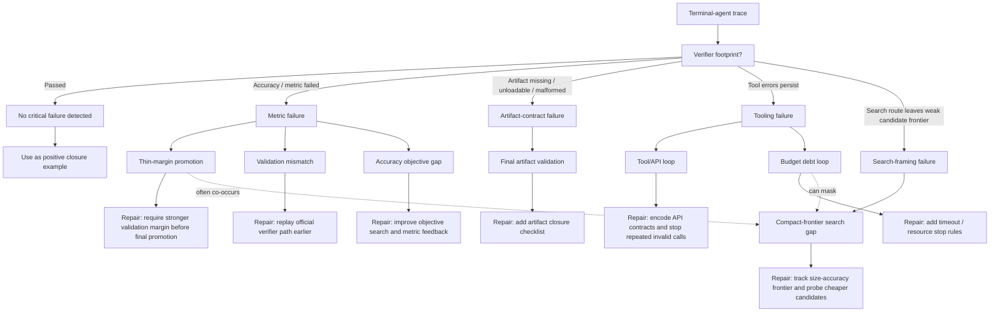

# Failure Taxonomy

Harness-TrajecDebug groups failures by the final verifier footprint first, then
links each footprint to a process-level failure pattern and an actionable harness
repair lever.

## Pattern Definitions

| Pattern | Trigger | Typical evidence | Repair lever |
| --- | --- | --- | --- |
| `thin-margin promotion` | Local/public metric barely clears threshold, final verifier fails | public `P@1=0.621`, private `P@1=0.617` | require margin before final artifact promotion |
| `validation mismatch` | Local validation differs substantially from final verifier | public high score, private low score | replay official verifier semantics earlier |
| `compact-frontier search gap` | Agent sees size pressure but does not search enough compact candidates | large raw model, quantized model, thin final margin | maintain a size-accuracy frontier |
| `accuracy objective gap` | Final metric fails without clear validation mismatch or margin story | verifier metric below threshold | improve search objective and feedback |
| `final artifact validation` | Final artifact missing, unloadable, malformed, wrong path | verifier cannot load or parse artifact | add path/loadability/format closure checks |
| `tool/API loop` | Repeated invalid calls or API misuse persist to terminal failure | repeated syntax/API errors | add API contract checks and stop rules |
| `budget debt loop` | Repeated timeout, killed, or memory-pressure events consume trajectory | `Exit code 137`, timeout logs | prefer cheap probes and resource-aware stopping |

## How To Read The Diagram

The taxonomy is not a flat list of labels. It is a routing tree:

1. Start from the final verifier footprint.
2. Find the process pattern that best explains how the trace reached that
   footprint.
3. Attach the earliest actionable evidence as the critical step.
4. Emit a repair lever for harness, prompt, verifier, or tooling design.
