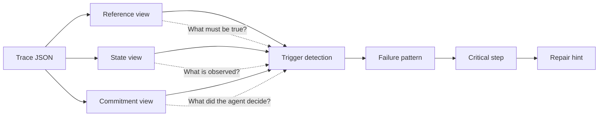

# Framework

Harness-TrajecDebug uses three views of the same terminal-agent trace.

## Reference View

Reference view contains the task/verifier contract:

- final artifact path
- size or resource gate
- metric and threshold
- verifier semantics
- task-specific API contracts

## State View

State view contains observations reconstructed from the trace:

- command outputs
- artifact size and path
- metric values
- timeout, killed, or API errors
- final verifier output

## Commitment View

Commitment view contains agent decisions inferred from explicit messages or
action sequences:

- choosing a route
- trusting a local validation score
- promoting a final artifact
- committing to compression or another repair route

## Critical Step

A critical step is the earliest actionable point where:

- a decision or commitment is evidenced,
- it conflicts with a reference object or state observation,
- the conflict leaves a final verifier footprint,
- a local counterfactual repair would plausibly change the outcome.
