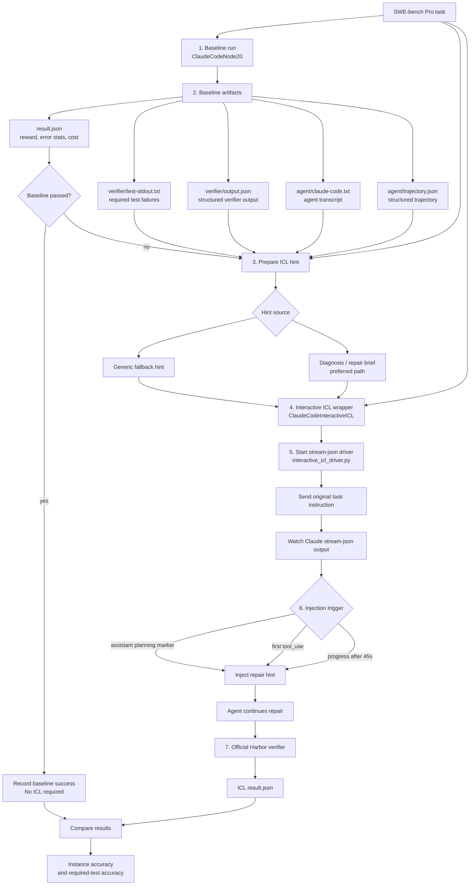

# SWE-bench Pro Interactive ICL V1

This document describes the current V1 algorithm used to run TrajecDebug-style
interactive ICL on SWE-bench Pro tasks. The implementation is intentionally
small: it reuses Harbor task execution, Claude Code as the repair agent, and a
stream-json driver that injects one repair hint after the baseline run has
started making progress.

## Algorithm Overview

The V1 flow has seven stages:

1. Run a normal baseline agent on the SWE-bench Pro instance.
2. Collect baseline artifacts and verifier failures.
3. Generate or prepare an ICL repair hint.
4. Start the interactive ICL wrapper on the same task.
5. Send the original task instruction to Claude Code.
6. Detect a stable injection point and send the repair hint as a second user
   message.
7. Let Harbor run the official verifier and compare baseline vs ICL results.



## Stage Details

### 1. Baseline Run

V1 runs the task with `ClaudeCodeNode20` instead of Harbor's built-in
`claude-code` agent. The reason is operational: some SWE-bench Pro images lack a
working Node/npm setup, and the built-in installer can fall back to
`https://claude.ai/install.sh`, which returned HTTP 403 in our runs.

Implementation:

- File: `local_harbor_agents/claude_code_node20.py`
- Class: `ClaudeCodeNode20`
- It installs missing `curl`, `bash`, `node`, and `npm` through the container's
  package manager when available.
- It installs Claude Code with `npm install -g @anthropic-ai/claude-code`.
- It uploads local Claude credentials into both `/logs/agent/sessions` and
  `/root/.claude/.credentials.json` when credentials are available.
- After setup, it delegates to Harbor's installed `ClaudeCode` agent.

Example Harbor invocation:

```bash
uvx harbor run \
  -d swebenchpro@1.0 \
  --agent-import-path local_harbor_agents.claude_code_node20:ClaudeCodeNode20 \
  -m kimi-k2.6 \
  --jobs-dir /home/admin/coding_agent_project/harbor_jobs \
  --n-tasks 5 \
  --n-concurrent 1 \
  --artifact /logs/agent/claude-code.txt \
  --artifact /logs/agent/trajectory.json \
  --yes
```

### 2. Baseline Artifact Collection

Harbor writes one directory per trial. V1 uses these files as the data boundary
between the baseline and ICL phases:

- `result.json`: reward, exception stats, token/cost stats, and trial status.
- `verifier/test-stdout.txt`: human-readable required-test results.
- `verifier/output.json`: structured verifier output, when available.
- `agent/claude-code.txt`: stream-json transcript from Claude Code.
- `agent/trajectory.json`: structured trajectory artifact.

The first V1 metric is instance-level accuracy:

```text
passed_instances / completed_instances
```

For SWE-bench Pro debugging, we also track required-test accuracy when verifier
output includes required test counts:

```text
passed_required_tests / required_tests
```

### 3. ICL Hint Generation

The hint is the bridge between baseline failure and the second repair attempt.
V1 supports two hint sources.

Generic fallback:

- Used when no diagnosis artifact is available.
- Stored in `ClaudeCodeInteractiveICL` as an in-code default.
- It tells the agent to inspect the previous verifier failure, apply the
  smallest code change, and run the targeted failing test before finishing.

Diagnosis / repair brief:

- Preferred path.
- Produced outside the wrapper from baseline verifier output and agent
  trajectory.
- The brief should identify the exact failed required test, the likely missing
  behavior, any misleading baseline patch direction, and the target tests to run.

The V1 hint should be short. It is not meant to replay the full trajectory. It
should compress the failure into an actionable repair instruction:

```text
Baseline failed required test <test>.
The previous patch changed <area> but did not handle <missing behavior>.
Focus on <file/function>.
Do not broaden behavior outside the task requirement.
Run <targeted test> before finishing.
```

Current implementation:

- Environment override:
  `HARNESS_TRAJECDEBUG_INTERACTIVE_ICL_HINT`
- Fallback hint in `local_harbor_agents/claude_code_interactive_icl.py`
- The wrapper writes the selected hint into
  `/logs/agent/interactive_icl_hint.txt` inside the task container.

### 4. Interactive ICL Wrapper

Implementation:

- File: `local_harbor_agents/claude_code_interactive_icl.py`
- Class: `ClaudeCodeInteractiveICL`
- Inherits from `ClaudeCodeNode20`.

The wrapper performs the normal Node20 Claude Code setup, then uploads:

- `interactive_icl_driver.py`
- `interactive_icl_instruction.txt`
- `interactive_icl_hint.txt`

It then executes:

```bash
python3 /logs/agent/interactive_icl_driver.py \
  /logs/agent/interactive_icl_instruction.txt \
  /logs/agent/interactive_icl_hint.txt \
  /logs/agent/claude-code.txt
```

### 5. Original Instruction Replay

The driver starts Claude Code with stream-json input and output:

```bash
claude \
  --verbose \
  --input-format=stream-json \
  --output-format=stream-json \
  --permission-mode=bypassPermissions \
  --print \
  --replay-user-messages
```

Implementation:

- File: `local_harbor_agents/interactive_icl_driver.py`
- Function: `_sdk_user_message`

The driver sends the original SWE-bench Pro instruction first, as a normal user
message. This keeps the first part of the run identical in intent to a normal
agent repair attempt.

### 6. Hint Injection

The driver reads Claude Code output line-by-line and parses stream-json events.
It injects the hint exactly once.

Injection triggers:

- The assistant emits planning text containing one of:
  - `Let me make the changes`
  - `Now I have the exact file contents`
  - `I need to`
  - `I'll`
- The assistant emits a `tool_use`.
- The driver has seen progress and at least 45 seconds have elapsed.

Before injection, the driver logs a marker:

```json
{
  "type": "system",
  "subtype": "harness_trajecdebug_interactive_icl_injected"
}
```

Then it sends the hint as a second user message through Claude Code stdin. This
is the core of V1 interactive ICL: the model first orients on the task normally,
then receives a targeted repair hint before it commits too far into a patch.

### 7. Verification and Comparison

After the agent exits, Harbor runs the official task verifier. V1 does not trust
agent self-reporting. The only pass/fail source is Harbor's verifier result.

Outputs:

- ICL `result.json`
- ICL `verifier/test-stdout.txt`
- ICL `verifier/output.json`
- ICL `agent/claude-code.txt`
- ICL `agent/trajectory.json`

Comparison:

```text
baseline_reward(instance) -> icl_reward(instance)
baseline_required_tests -> icl_required_tests
```

## V1 Design Properties

- Single-shot injection: one hint is injected once per ICL run.
- No automatic retry loop: verifier failures after ICL are not repaired again by
  this wrapper.
- Hint content is externalized through an environment variable so experiments can
  compare generic hints against diagnosis-derived hints.
- Stream-json is used so the wrapper can preserve full Claude Code logs while
  injecting at runtime.
- The original task instruction remains the first user message to preserve the
  SWE-bench Pro task framing.

## Known Limitations

- Diagnosis generation is not yet fully automated in the wrapper.
- The injection trigger is heuristic and text-marker based.
- The default hint is generic and much weaker than a task-specific repair brief.
- The wrapper assumes Claude Code supports `--input-format=stream-json`,
  `--output-format=stream-json`, and `--replay-user-messages`.
- The approach currently runs one ICL attempt per failed baseline instance.

## Next Iteration

The main V2 improvement should automate the `verifier + trajectory -> repair
brief` step. The target output is a compact, structured hint containing:

- failing required test names,
- observed vs expected behavior,
- files/functions touched by the failed baseline patch,
- likely missing condition,
- negative guidance to avoid repeating the baseline mistake,
- exact targeted test command.
