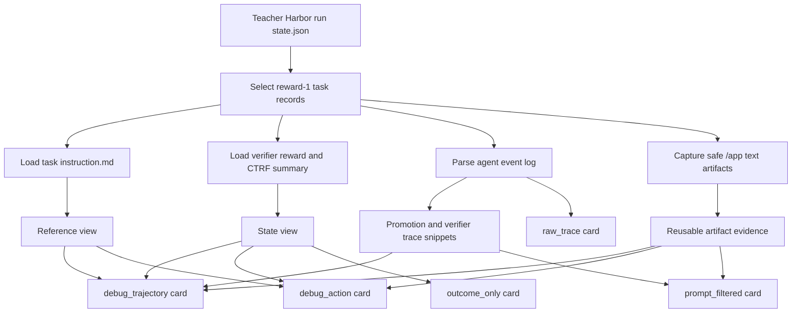
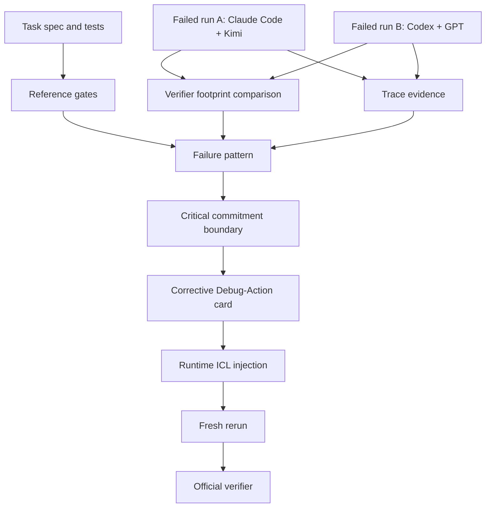
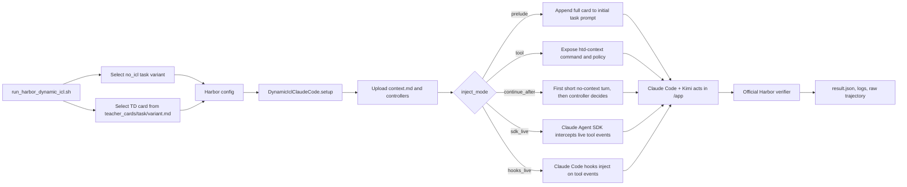
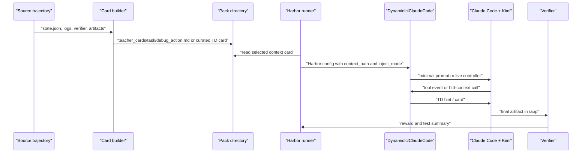

# TrajectoryDebug Hint Generation and Runtime ICL Flow

This note documents the current implementation used by the PR experiments. It
separates three pieces that are easy to mix together:

- hint generation: how a previous trajectory becomes a compact card;
- failed-run diagnosis: how a wrong trajectory can still produce a corrective
  hint;
- runtime ICL injection: how that card is delivered to Claude Code + Kimi
  during a Harbor run.

There are two hint-generation regimes in the repo today. The first is an
automated passing-teacher path for ICL baselines. The second is the more
TrajectoryDebug-specific failed-evidence path: even when the source run is
wrong, the trace can expose the wrong commitment and the verifier footprint can
tell us what corrective boundary to inject into the next run.

The current implementation is intentionally conservative. Some card generation
is automated and template based; the stronger joint-failure cards are currently
curated from TD diagnosis evidence. The value being tested in this PR is whether
process-aware cards are better ICL interventions than outcome-only or raw-trace
context.

## Current Hint Generation Algorithm

Input objects:

- `state.json` from one or more teacher Harbor runs;
- each task's `instruction.md`;
- verifier outputs such as `reward.txt` and `ctrf.json`;
- agent event logs such as `codex-events.jsonl`;
- copied container artifacts under `/app/...`.

Output objects:

- `teacher_cards/<task>/outcome_only.md`;
- `teacher_cards/<task>/raw_trace.md`;
- `teacher_cards/<task>/prompt_filtered.md`;
- `teacher_cards/<task>/debug_trajectory.md`;
- `teacher_cards/<task>/debug_action.md`.

The automated builder currently accepts reward-1 teacher examples, reads the
task contract and verifier summary, extracts bounded trace snippets, captures
safe text artifacts, and emits several comparable card variants. Manual or
oracle-free joint-failure cards can use the same runtime path as long as they
are written to the same `teacher_cards/<task>/<variant>.md` interface.



This path is useful for controlled ablations: can a smaller model use a known
good trajectory better when the context is structured as TD process evidence
instead of only as a final reward or raw logs?

## Failed-Run TD Hint Generation

This is the core TD idea behind the stronger case studies. A source trajectory
does not need to be correct. A failed run can generate a useful hint if it
contains enough evidence to identify:

- the task/verifier gate that was violated;
- the state where the agent was still recoverable;
- the wrong decision or commitment that pushed the run onto the failing branch;
- the replacement commitment that would avoid the same failure pattern.

For joint-failure cases, TD compares multiple failed traces. One run may
under-solve while another over-solves, or both may fail the same verifier gate.
The hint is synthesized from the contrast, not copied from a passing artifact.



Examples already documented in the repo:

| Case | Failed evidence | Corrective TD hint |
| --- | --- | --- |
| `sanitize-git-repo` | Kimi missed an embedded token; Codex over-solved by mutating git history | treat the task as bounded working-tree sanitization; preserve git history |
| `filter-js-from-html` | both agents blocked XSS but changed clean HTML | treat clean preservation as the binding gate; avoid aggressive rewriting |
| `sam-cell-seg` | compared failures exposed different verifier gates | combine the gates into one bounded segmentation action |

So "teacher run" should be read as "source trajectory" in the TD setting. The
source trajectory can be a pass, a near miss, or a clear failure. What matters
is whether it provides process evidence that can be turned into a better next
commitment.

The card variants are the ablation boundary:

| Variant | What it contains | Why it matters |
| --- | --- | --- |
| `no_icl` | original task instruction only | baseline |
| `outcome_only` | task name, teacher reward, verifier summary | tests whether final outcome alone helps |
| `raw_trace` | bounded teacher log snippets | tests whether raw trace exposure is enough |
| `prompt_filtered` | artifacts and selected log snippets without TD labels | approximates generic LLM/prompt filtering |
| `debug_trajectory` | reference view, state view, commitment-style strategy notes, reusable evidence, verifier/promotion trace | process-aware TD card |
| `debug_action` | reference view, teacher outcome, executable artifact materialization command, guardrails | action-biased TD card for same-task repair smoke tests |

## What The TD Hint Means

In the current implementation, a TD hint is not merely "the previous run
passed." It tries to preserve the part of the trace that should change the
student agent's next commitment:

- Reference view: what the live task actually requires.
- State view: what the source trajectory produced, failed to produce, or exposed
  through verifier output.
- Commitment guidance: what route should be preferred before expensive search.
- Reusable evidence: artifact content or trace snippets that can be checked in
  the live container.
- Guardrails: when to reuse, when to recompute, and when to stop.

For `debug_action`, the strongest signal is the generated shell block. If the
captured teacher artifact is a safe text file under `/app/...`, the card turns
it into:

```bash
mkdir -p /app
cat > /app/sol.sql <<'HTD_ARTIFACT_EOF'
...
HTD_ARTIFACT_EOF
```

The point is not blind copying. The card explicitly tells the agent to reuse it
only when the live task contract and artifact path match, then run the cheapest
closure check. If that check fails, the agent should fall back to recomputation.
For failed-run TD cards, the action block may instead be a synthesized repair
boundary or checklist. In that case the useful signal is the corrected
commitment, not a copied passing artifact.

## Runtime ICL Injection Flow

The runtime experiment uses the original task prompt from the `no_icl` task
variant and selects a card at run time:

```bash
scripts/run_harbor_dynamic_icl.sh \
  --task query-optimize \
  --context-variant debug_action \
  --inject-mode sdk_live \
  --sdk-live-intercept-tool Bash
```

The script builds a Harbor config that imports
`DynamicIclClaudeCode`. During setup, the agent uploads the selected card and
controller files into the task container:

- `/opt/harness-trajecdebug/context.md`;
- `/opt/harness-trajecdebug/continue_prompt.md`;
- `/usr/local/bin/htd-context`;
- `/usr/local/bin/htd-controller-decision`;
- live SDK / hook controller files.



The five injection modes answer different experimental questions:

| Mode | Delivery mechanism | Intended use |
| --- | --- | --- |
| `prelude` | append the card to the first prompt | maximum-context upper bound |
| `tool` | tell the agent to call `htd-context` after reading the task | tests whether the agent can actively retrieve a prior-trace lesson |
| `continue_after` | let the first turn run without context, then inject if the controller sees a trigger | tests delayed correction |
| `sdk_live` | run through the Python Claude Agent SDK and inject on `PreToolUse` or `AskUserQuestion` | interactive key-path correction |
| `hooks_live` | use Claude Code hook settings and `additionalContext` | CLI-native live injection path |

Live triggers currently include:

- `AskUserQuestion`;
- configured tools such as `Bash`, `WebSearch`, or `WebFetch`;
- dependency-install Bash commands;
- first-turn evidence such as artifact missing or artifact mismatch in
  `continue_after`.

When `sdk_live` or `hooks_live` fires, the controller injects this shape of
message:

```text
HARNESS-TRAJECDEBUG LIVE ICL INJECTION

Trigger: <reason>

Use the prior-trace guidance below before continuing...

<selected TD card>
```

## End-To-End Data Path



## How To Interpret The Current Result

The reported TB2.1 result is:

- without TrajectoryDebug: `38/89`;
- with TrajectoryDebug: `46/89`;
- lift: `8` additional tasks.

For the main lift count, a task is counted only when Claude Code + Kimi-k2.6
runs with a TD context card and the official verifier returns reward 1. Direct
artifact-closure checks are reported separately and are not counted as model
agent lift.

This means the current claim is modest but concrete:

> Process-aware TD cards can turn some previously failing Claude Code + Kimi
> Harbor/Terminal-Bench runs into verifier-passing runs, and they outperform
> outcome-only context on the tested same-task canary.

The stronger future claim is to replace more of the template/card construction
with automatic critical-step mining from failed traces, then test held-out
cross-task selection against outcome-only, raw-trace, and prompt-filtered
baselines.
